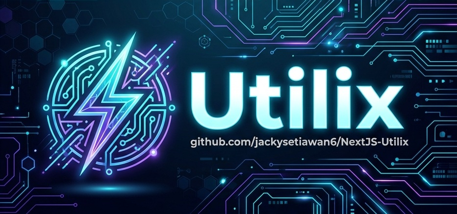

# Utilix

[](https://github.com/jackysetiawan6/NextJS-Utilix)
[](https://utilix.vercel.app)



**Utilix** is a premium, interactive single-line diagram (SLD) and electrical power distribution management dashboard designed for modern data centers. It empowers supervisors and operators to design, configure, simulate, and monitor complex electrical trees, transfer switch parameters, safety interlocks, and downstream power topologies in real-time. Built using **Next.js**, **React Flow**, **TypeScript**, and **Supabase**, it features a responsive design with real-time sync, electrical simulation, safety interlock enforcement, and persistent event logging.

---

## 🚀 Key Features

*   **🌐 Interactive Single-Line Diagram (SLD):** Powered by React Flow with zoom, pan, item dragging, and collapsible tree branches to minimize visual clutter on complex canvas layouts.
*   **🔀 Decoupled Port Naming:** Source panel outgoing and target panel incoming port tags can be named independently. Wires on the canvas display combined labels (`Outgoing → Incoming`) when different, and fall back to the single name when matching.
*   **🔋 Power Flow Simulation:** Runs an electrical fixed-point iterative convergence algorithm to resolve panel statuses (`Online`, `Offline`, `Maintenance`) correctly, regardless of canvas rendering order.
*   **⚡ Safety Interlocks:** Blocks dangerous manual short-circuits by checking active source paths and warning the operator of interlock violations before closing multiple incoming breakers.
*   **🔑 Role-Based Access Control (RBAC):** Switch between Supervisor, Operator, and View-Only modes via passcode validation, enforcing granular operation and editing permissions.
*   **💾 Database Sync & Realtime:** Real-time database sync using Supabase Broadcast/Presence, with a fallback Mock Mode indicator and tooltip if environment keys are missing.
*   **⏱️ Undo/Redo & Drag Performance:** Full state history tracking optimized for continuous drag operations, committing history entries only when node dragging completes.
*   **📜 Event Logging Audit:** Records all user actions and safety violations in an audit log, with a dedicated, searchable Event Logs page.

---

## 📂 Project Structure

```
NextJS-Utilix/
├── .env.example          # Sample environment variables configuration
├── components.json       # Shadcn UI configuration
├── next.config.ts        # Next.js build configuration
├── package.json          # Dependency and script definitions
├── tailwind.config.ts    # Tailwind styling configuration
├── tsconfig.json         # TypeScript configuration
├── public/               # Static assets folder
│   ├── logo.png          # High-quality brand logo
│   └── banner.png        # Sleek 3:1 aspect ratio repository banner
├── supabase/             # Supabase database schema and migrations
│   └── migrations/
│       └── supabase-schema.sql
└── src/                  # Application Source Code
    ├── app/              # Next.js App Router pages and layouts
    │   ├── log/
    │   │   └── page.tsx  # Event logs viewer page component
    │   ├── globals.css   # Theme styling tokens and custom rules
    │   ├── layout.tsx    # Root layout template
    │   ├── page.tsx      # Main dashboard page entry point
    │   └── react-flow.css # Custom styling for React Flow handles and nodes
    ├── components/       # Custom React UI components
    │   ├── custom-nodes/
    │   │   ├── distribution-panel-node.tsx # Collapsible downstream power panels
    │   │   └── source-panel-node.tsx       # Power source input panels (Group A / B)
    │   ├── ui/           # Radix UI core primitive components
    │   ├── auth-modal.tsx      # Passcode role authentication gate modal
    │   ├── context-menu.tsx    # Right-click node layout actions context menu
    │   ├── diagram-canvas.tsx  # React Flow canvas coordinator and drag listeners
    │   ├── diagram-sidebar.tsx # Selected panel properties and connections sidebar editor
    │   ├── header.tsx          # System guide help, undo/redo, and menu bar
    │   ├── main-layout.tsx     # Layout builder wrapper
    │   ├── role-switcher.tsx   # Role switcher button
    │   ├── search-panel.tsx    # Cmd+K search panel matching names and locations
    │   ├── theme-provider.tsx  # CSS theme wrapper
    │   └── theme-toggle.tsx    # Dark/Light/System theme toggle
    ├── contexts/         # React Context API state providers
    │   ├── auth-context.tsx    # Simulation case save/load/auth controls
    │   ├── diagram-context.tsx # Fixed-point simulation, RLS sync, and mutations context
    │   └── role-context.tsx    # Active permission level check context
    ├── hooks/            # Custom hooks
    │   └── use-toast.ts        # Reusable alert notifications hook
    └── lib/              # Shared utilities and helpers
        ├── initial-data.ts     # Pre-configured 13-node, 13-edge data center tree preset
        ├── log-service.ts      # Client-side helper to record logs in Supabase
        ├── supabase.ts         # Supabase client instantiation
        ├── types.ts            # TypeScript interfaces for panels and logs
        └── utils.ts            # Helper function for Tailwind class merging
```

---

## 🛠️ Technology Stack

*   **Frontend:** Next.js 15 (App Router), React 19, TypeScript, React Flow, TailwindCSS, Lucide Icons
*   **Backend / Database:** Supabase (PostgreSQL)
*   **Realtime Sync:** Supabase Realtime (Publication channels)

---

## 📦 Architecture & Database Design

Utilix couples its electrical simulation context with a Supabase PostgreSQL backend, supporting real-time visual collaboration across active clients.

### Key Database Tables
*   `diagrams`: Top-level diagram documents containing metadata, owner IDs, and membership lists.
*   `panels`: Individual equipment nodes storing coordinates, custom property lists, and status.
*   `connections`: Electrical wiring edges holding breaker/selector configurations, priority, and the delimited `tag` (storing `outgoingTag|||incomingTag` for decoupled naming).
*   `logs`: Event log audit database.
*   `simulation_cases`: Pre-saved scenario cases containing complete canvas snapshots.

### Simulation Engine & Convergence
*   **Fixed-Point Loop**: Evaluates active flow using a loop that runs until panel power statuses (`Online`/`Offline`) stabilize, ignoring canvas rendering order.
*   **Safety Interlocks**: Enforces interlock constraints client-side, blocking operator actions if they attempt to close multiple manual feeds onto a single panel.
*   **Decoupled Tags**: Uses a backward-compatible serialization strategy, packing both source and target names in the `tag` column (`outgoing_tag|||incoming_tag`) to preserve 100% compatibility with older plain-text tags and require **zero SQL migration/database downtime**.

---

## 🔧 Getting Started

### Prerequisites
*   Node.js (v18 or higher)
*   NPM or PNPM
*   A Supabase Project

### Local Installation

1.  **Clone the Repository:**
    ```bash
    git clone https://github.com/jackysetiawan6/NextJS-Utilix.git
    cd NextJS-Utilix
    ```

2.  **Install Dependencies:**
    ```bash
    npm install
    ```

3.  **Environment Variables:**
    Create a `.env.local` file in the root directory:
    ```env
    NEXT_PUBLIC_SUPABASE_URL=your_supabase_url
    NEXT_PUBLIC_SUPABASE_ANON_KEY=your_supabase_anon_key
    ```
    *If environment variables are omitted, Utilix automatically falls back to local Mock Mode so you can still try all features without a backend!*

4.  **Database Migrations:**
    Apply the SQL scripts under the `supabase/migrations/` folder directly to your Supabase SQL Editor.

5.  **Run Development Server:**
    ```bash
    npm run dev
    ```

6.  **Build for Production:**
    ```bash
    npm run build
    ```

---

## 🤝 Contributing

Contributions are welcome! Please open an issue or submit a pull request if you want to suggest improvements, report bugs, or add new features.

---

## 📄 License

This project is licensed under the MIT License - see the [LICENSE](LICENSE) file for details.
